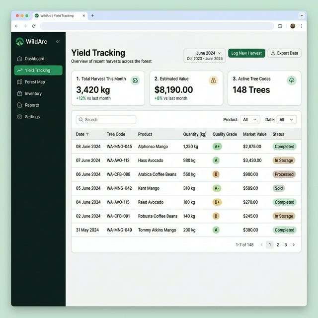
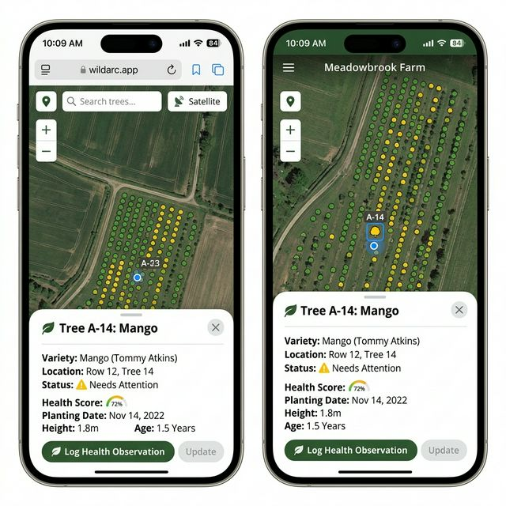

# Arbor V2 Design Specifications

The Arbor module focuses on tracking individual trees. Version 2 introduces advanced agronomic features like yield tracking and true GIS mapping.

## 1. Yield Tracking Dashboard

**Goal:** Allow users to log harvests by tree, product type, quantity, and grade, and see the financial/volume output of the land.

### Key UI Elements:
- **Top Row KPIs**: Total Harvest (kg), Estimated Value ($), Active Trees. Include month-over-month trend indicators.
- **Filter Bar**: Date range picker (crucial for seasonality), Product dropdown (Mango, Coffee), Status dropdown.
- **Data Table**: 
  - `Date`: When it was harvested
  - `Tree Code`: Clickable link to the tree profile
  - `Product`: What was harvested
  - `Quantity`: With explicit units
  - `Quality Grade`: Color-coded pill badge (A+, A, B, C, Reject)
  - `Market Value`: Computed or manually entered
- **Call to Action**: Prominent "Log New Harvest" button.

---

## 2. Interactive GIS Map (Mobile View)

**Goal:** Field workers need to see where they are on the farm relative to the trees, and see the status of trees at a glance.

### Key UI Elements:
- **Base Layer**: High-res satellite imagery switchable to terrain/vector map.
- **Markers**: Interactive circles representing trees. 
  - Color = Status (Green = Healthy, Yellow/Orange = Needs Attention)
- **Selected State**: When a tree is tapped, the marker highlights and a bottom drawer slides up.
- **Bottom Drawer**:
  - Tree Code and Species title
  - Location coordinates/row assignment
  - Current health score / age
  - Primary CTA: "Log Health Observation" (large tap target for field use)
