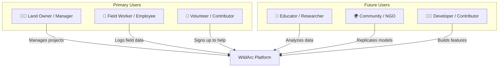

# 👥 Use Cases & Personas

> *Who uses WildArc, what problems do they face, and how does each module solve them?*

---

## Persona Overview

---

## 👤 Persona 1: Land Owner / Farm Manager

> *"I own 5 acres of land in Coorg and I'm converting it into a food forest. I need to track 200+ trees across 8 zones, assign work to my team, and prove that this approach works."*

**Name:** Yogesh (Prototype User)  
**Role:** `owner` / `admin`  
**Technical Level:** Moderate — comfortable with apps, not a developer

### Problems
| Problem | Impact |
|---------|--------|
| Can't remember which trees need what action | Missed treatments, lower yields |
| Workers don't know their daily tasks | Wasted time, confusion |
| No way to track long-term health trends | Can't prove what works |
| Data is scattered across notebooks and photos | Not shareable, not analyzable |
| Can't show visitors/supporters what's happening | Hard to build community |

### Use Cases

#### UC-1.1: Morning Briefing
> As a **land owner**, I want to open the dashboard and immediately see: how many trees are pending action, which zones need attention, and what's urgent today — **so I can plan my day in 30 seconds**.

**Module:** Arbor (Dashboard)  
**Status:** ✅ Implemented

#### UC-1.2: Add a New Tree
> As a **land owner**, I want to add a tree by selecting its location on a visual map of my land, choose its species, zone, and assign it to a worker — **so the tree enters the system immediately with spatial context**.

**Module:** Arbor (TreeAdd + MapPicker)  
**Status:** ✅ Implemented

#### UC-1.3: Track Companion Planting
> As a **land owner**, I want to log which understory plants I've planted around a tree and track their survival rate over seasons — **so I can learn which Guilds work best on my land**.

**Module:** Flora (Guilds)  
**Status:** 🔜 Planned

#### UC-1.4: Monitor Soil Health
> As a **land owner**, I want to record soil pH, organic matter, and moisture levels per zone — **so I can correlate soil conditions with tree health and adjust my practices**.

**Module:** Terra (Soil Telemetry)  
**Status:** 📋 Planned

#### UC-1.5: Multi-Project Management
> As a **land owner** managing **multiple plots of land**, I want each plot to be a separate project with its own team, trees, and zones — **so I can scale WildArc to my entire operation**.

**Module:** Core (Multi-Tenant)  
**Status:** 🔄 In Progress (DB schema done, backend/frontend pending)

#### UC-1.6: Share Public Tree Profiles
> As a **land owner**, I want visitors to scan a QR code on a tree and see its story, species info, ecosystem roles, and caretakers — **so I can educate and inspire people who visit my land**.

**Module:** Arbor (PublicTree)  
**Status:** ✅ Implemented

---

## 👤 Persona 2: Field Worker / Employee

> *"I work on the farm and need to know what to do each day. I don't want a complicated app — just show me my tasks and let me mark them done."*

**Name:** Shiva  
**Role:** `employee`  
**Technical Level:** Low — uses WhatsApp and basic phone apps

### Problems
| Problem | Impact |
|---------|--------|
| Verbal instructions are easy to forget | Trees get missed |
| Can't easily report tree health issues | Problems go unnoticed |
| No feedback on his own work progress | Low motivation |
| Needs to work even without internet | App becomes useless in field |

### Use Cases

#### UC-2.1: My Daily Tasks
> As a **field worker**, I want to see only the trees assigned to me, sorted by priority — **so I know exactly what to do today without scrolling through all trees**.

**Module:** Arbor (FieldHome)  
**Status:** ✅ Implemented

#### UC-2.2: Log a Health Observation
> As a **field worker**, when I notice a tree is sick or damaged, I want to instantly log a health score, take a photo, and describe the issue — **so the owner is alerted and can take action**.

**Module:** Arbor (HealthLog + Photos)  
**Status:** ✅ Implemented

#### UC-2.3: Update Task Status
> As a **field worker**, after I finish cutting/trimming a tree, I want to mark it as complete with one tap — **so my work is recorded and the dashboard updates in real-time**.

**Module:** Arbor (TreeDetail → status update)  
**Status:** ✅ Implemented

#### UC-2.4: Offline Mode
> As a **field worker** in an area with no signal, I want the app to save my data and sync it when I'm back online — **so I never lose field observations**.

**Module:** Core (PWA + Offline Sync)  
**Status:** 🔄 PWA shell exists, but robust offline sync not yet implemented

---

## 👤 Persona 3: Volunteer / Community Member

> *"I'm passionate about permaculture and want to contribute to a real project. I signed up online and want to learn by helping."*

**Name:** Priya  
**Role:** `volunteer`  
**Technical Level:** Moderate

### Use Cases

#### UC-3.1: Sign Up and Explore
> As a **volunteer**, I want to create an account, browse the public data, and see which project I can join — **so I can start contributing without waiting for approval**.

**Module:** Core (Auth → Signup)  
**Status:** ✅ Implemented

#### UC-3.2: Adopt a Tree
> As a **volunteer**, I want to be listed as a contributor to a specific tree with my role (e.g., "weekend caretaker") — **so I feel personal ownership and the tree's public page credits me**.

**Module:** Arbor (TreeContributors)  
**Status:** ✅ Implemented

#### UC-3.3: Log Species Knowledge
> As a **volunteer** who is a botany enthusiast, I want to contribute detailed species information (medicinal uses, edible parts, ecosystem roles) — **so the platform's knowledge base grows from community expertise**.

**Module:** Arbor (Species Management) + Future: Community Wiki  
**Status:** ✅ Basic species CRUD exists; community contribution workflow planned

---

## 👤 Persona 4: Educator / Researcher

> *"I want to use WildArc data to teach agroforestry at my university and publish research on companion planting effectiveness."*

**Name:** Dr. Meera  
**Role:** `viewer` (read-only API access)  
**Technical Level:** High — comfortable with data analysis tools

### Use Cases

#### UC-4.1: Export Data for Analysis
> As a **researcher**, I want to export tree health data, yield records, and companion planting logs as CSV/JSON — **so I can run statistical analyses in R or Python**.

**Module:** Core (Data Export API)  
**Status:** ❌ Not yet implemented

#### UC-4.2: Interactive Mind Maps
> As an **educator**, I want to show students an interactive visualization of how plants in a Guild support each other — **so they can understand ecosystem design through a living example**.

**Module:** Synapse (Mind Maps)  
**Status:** 💡 Future

#### UC-4.3: Compare Across Farms
> As a **researcher**, I want to query aggregate data across multiple WildArc projects (with permission) — **so I can compare Guild effectiveness across different climates and soil types**.

**Module:** Synapse (Cross-Project Analytics)  
**Status:** 💡 Future

---

## 👤 Persona 5: Open Source Developer

> *"I want to pick up an issue and start contributing. I need clear setup instructions, defined module boundaries, and well-documented APIs."*

**Name:** Arjun  
**Role:** External contributor  
**Technical Level:** High

### Use Cases

#### UC-5.1: First-Time Setup
> As a **developer**, I want to clone the repo, run `npm install && npm run dev`, and have the entire app running locally in under 5 minutes — **so I can start coding immediately without environment hell**.

**Module:** Core (Dev Environment)  
**Status:** ✅ Works for backend, needs Docker/Supabase local dev story

#### UC-5.2: Pick an Issue
> As a **developer**, I want to browse GitHub Issues labeled by module (`arbor`, `flora`, `terra`) and difficulty (`good-first-issue`, `help-wanted`) — **so I know exactly what to work on and how hard it is**.

**Module:** OSS Infrastructure  
**Status:** ❌ Not yet set up (no issue templates, labels, or contributing guide)

#### UC-5.3: Build a New Module
> As an **experienced developer**, I want to scaffold a new module (e.g., `Flora`) using a template/generator that sets up the folder structure, DB migrations, routes, and frontend pages — **so I follow the architecture conventions without reading the entire codebase**.

**Module:** Core (Module Scaffolding)  
**Status:** ❌ Not yet implemented

---

## Use Case Summary Matrix

| Use Case | Persona | Module | Status |
|----------|---------|--------|--------|
| UC-1.1 Morning Briefing | Owner | Arbor | ✅ |
| UC-1.2 Add Tree | Owner | Arbor | ✅ |
| UC-1.3 Companion Planting | Owner | Flora | 🔜 |
| UC-1.4 Soil Monitoring | Owner | Terra | 📋 |
| UC-1.5 Multi-Project | Owner | Core | 🔄 |
| UC-1.6 Public Tree Profile | Owner | Arbor | ✅ |
| UC-2.1 Daily Tasks | Worker | Arbor | ✅ |
| UC-2.2 Health Observation | Worker | Arbor | ✅ |
| UC-2.3 Update Status | Worker | Arbor | ✅ |
| UC-2.4 Offline Mode | Worker | Core | 🔄 |
| UC-3.1 Signup & Explore | Volunteer | Core | ✅ |
| UC-3.2 Adopt a Tree | Volunteer | Arbor | ✅ |
| UC-3.3 Species Knowledge | Volunteer | Arbor | ✅ |
| UC-4.1 Data Export | Researcher | Core | ❌ |
| UC-4.2 Mind Maps | Educator | Synapse | 💡 |
| UC-4.3 Cross-Farm Compare | Researcher | Synapse | 💡 |
| UC-5.1 Dev Setup | Developer | Core | ✅ |
| UC-5.2 Pick an Issue | Developer | OSS | ❌ |
| UC-5.3 Module Scaffolding | Developer | Core | ❌ |

---

*These use cases should drive every sprint, feature, and pull request in the project.*
