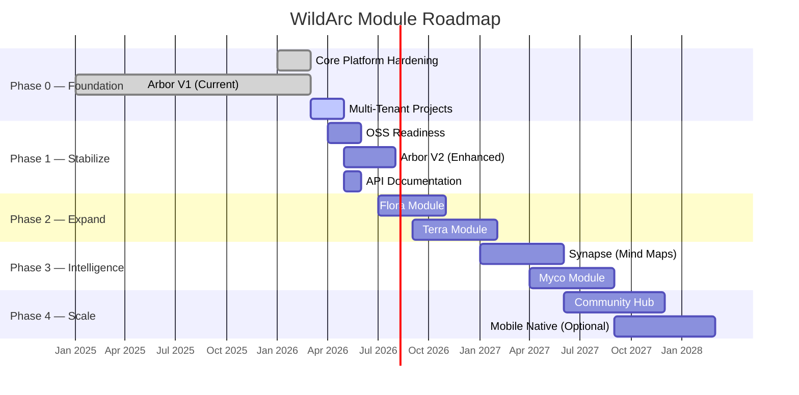
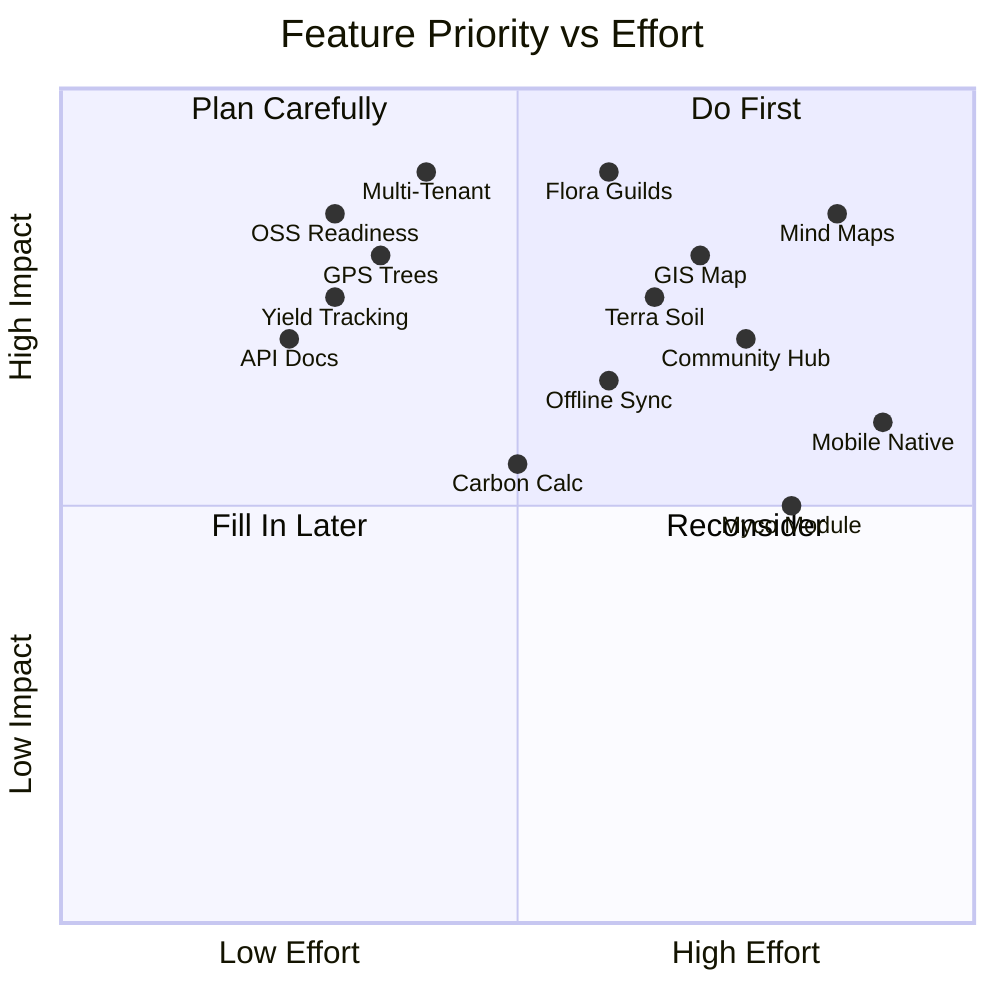

# 🗺️ Module Roadmap

> *A phased rollout plan for every module in the WildArc Ecosystem Suite.*

---

## Phase Overview



---

## Phase 0: Foundation (Current — Jan 2025 → May 2026)

### ✅ Arbor V1 — The Canopy Module
The foundational module. Already built and operational.

| Feature | Status | Description |
|---------|--------|-------------|
| Tree CRUD | ✅ Done | Add, edit, delete trees with codes, species, zones |
| Tree Lifecycle | ✅ Done | Status workflow: pending → in_progress → completed |
| Actions | ✅ Done | Cut, trim, treat, monitor, replant, keep |
| Health Observations | ✅ Done | Score 1-10, observed issues, notes, timestamp |
| Activity Log | ✅ Done | Full audit trail per tree (auto + manual entries) |
| Photo Management | ✅ Done | Upload photos via Google Drive integration |
| Species Database | ✅ Done | Common/scientific names, ecosystem roles, edible parts, fun facts |
| Land Zones | ✅ Done | Define zones with codes and descriptions |
| Map View | ✅ Done | Visual canvas with tree positions (X/Y coordinates) |
| Public Tree Profile | ✅ Done | QR-scannable public page per tree with contributors |
| Tree Contributors | ✅ Done | Link users to specific trees with roles |
| Dashboard | ✅ Done | Stats, progress bar, urgent alerts, zone summary |
| Field Worker Home | ✅ Done | Employee-view with assigned tasks |
| Auth (JWT) | ✅ Done | Login, signup, refresh tokens, password change |
| RBAC | ✅ Done | Owner / Employee / Volunteer role separation |
| PWA | ✅ Done | Installable app with Workbox caching |

### 🔄 Multi-Tenant Projects
| Feature | Status | Description |
|---------|--------|-------------|
| Projects table | ✅ Schema done | UUID-based project entity |
| Project Members | ✅ Schema done | Junction table with granular roles (admin/editor/contributor/viewer) |
| Trees → project_id | ✅ Migration done | Foreign key linking trees to projects |
| Zones → project_id | ✅ Migration done | Foreign key linking zones to projects |
| Backend scoping | ❌ Pending | All queries must filter by project_id |
| Frontend project picker | ❌ Pending | UI to switch between projects |
| Data backfill | ❌ Pending | Assign existing records to a default project |

---

## Phase 1: Stabilize (Apr 2026 → Aug 2026)

### 🔧 Open-Source Readiness
- [ ] CONTRIBUTING.md, CODE_OF_CONDUCT.md, LICENSE
- [ ] GitHub Issue templates with module labels
- [ ] PR template with checklist
- [ ] CI/CD pipeline (lint, test, build)
- [ ] Docker Compose for local development (app + local Supabase)
- [ ] Seed data scripts for new contributors
- [ ] API documentation (OpenAPI / Swagger)

### 🌳 Arbor V2 — Enhanced Canopy
| Feature | Priority | Description |
|---------|----------|-------------|
| Yield Tracking | 🔴 High | Log fruit/timber/product yields per tree per season |
| Growth Metrics Over Time | 🔴 High | Track height, diameter, canopy spread as time-series |
| Geo-Located Trees (GPS) | 🔴 High | Replace canvas X/Y with real latitude/longitude coordinates |
| Interactive GIS Map | 🟡 Medium | Integrate Leaflet/Mapbox for satellite imagery + tree pins |
| QR Code Generator | 🟡 Medium | Auto-generate and print QR codes for tree tags |
| Tree Age Calculator | 🟢 Low | Auto-calculate age from planting_date |
| Bulk Import/Export | 🟡 Medium | CSV upload/download for trees, zones, species |
| Notification System | 🟡 Medium | Alerts when trees need attention (health drops, task overdue) |
| Advanced Filters & Search | 🟡 Medium | Filter by species, health range, age, zone, contributor |
| Photo Gallery | 🟢 Low | Timeline view of tree photos showing visual growth |

---

## Phase 2: Expand (Jul 2026 → Feb 2027)

### 🌿 Flora Module — The Understory
> Manage companion plants, herbs, ground covers, and the concept of **Permaculture Guilds**.

#### What Is a Guild?
A Guild is a group of plants that support each other — like apple trees planted with comfrey (nutrient accumulator), clover (nitrogen fixer), and dill (pest repellent). WildArc Flora tracks these relationships with data.

| Feature | Description |
|---------|-------------|
| **Plant Database** | Catalog of understory plants with growth habits, needs, and synergies |
| **Guild Designer** | Visual tool to compose Guilds from the plant database |
| **Guild Templates** | Pre-built Guild recipes (e.g., "Tropical Fruit Guild", "Medicinal Herb Spiral") |
| **Planting Logs** | Record what was planted where, when, and around which tree |
| **Survival Tracking** | Monitor which plants lived, died, or thrived per season |
| **Companion Success Score** | Data-driven score for each plant combination based on survival and yield |
| **Symbiosis Graph** | Visual network showing which plants help/hinder each other |
| **Seasonal Calendar** | What to plant/harvest by month, adapted to local climate zone |

#### Database Concepts
```
plants              → id, name, type, growth_habit, water_needs, sun_needs
guilds              → id, name, description, template_source
guild_members       → guild_id, plant_id, tree_id (anchor), role_in_guild
planting_logs       → id, plant_id, zone_id, tree_id, planted_date, status
companion_scores    → plant_a_id, plant_b_id, observed_score, sample_count
```

---

### 🪨 Terra Module — The Earth Layer
> Monitor soil health, water management, topography, and land-level conditions.

| Feature | Description |
|---------|-------------|
| **Soil Profiles** | Record pH, organic matter, NPK levels, texture, moisture per zone |
| **Soil Test Log** | Timestamped log of all soil tests with method and results |
| **Water Sources** | Track ponds, swales, borewells, rainfall with levels/flow rates |
| **Water Flow Map** | Visualize how water moves through the property (contour + drainage) |
| **Topography Data** | Elevation mapping, slope analysis, aspect (sun exposure) |
| **Climate Zones** | Define micro-climates within the property |
| **Weather Integration** | Pull local weather data (rainfall, temperature, humidity) from API |
| **Sensor Integration (IoT)** | Support for soil moisture and temperature sensors (future hardware) |

#### Database Concepts
```
soil_profiles       → id, zone_id, ph, organic_matter, npk_nitrogen, npk_phosphorus, npk_potassium, texture, tested_at
water_sources       → id, name, type (pond/swale/borewell), capacity, current_level, zone_id
weather_logs        → id, recorded_at, temp_c, humidity, rainfall_mm, wind_speed, source
elevation_points    → id, zone_id, lat, lng, elevation_m
```

---

## Phase 3: Intelligence (Jan 2027 → Sep 2027)

### 🧠 Synapse — The Intelligence Layer
> Cross-module analytics, interactive Mind Maps, and AI-powered insights.

| Feature | Description |
|---------|-------------|
| **Guild Mind Maps** | Interactive force-directed graph showing plant relationships based on real data |
| **Ecosystem Health Score** | Single composite score per zone combining tree health, soil quality, biodiversity |
| **Yield Predictions** | ML-based predictions for harvest based on historical trends |
| **Optimal Guild Suggestions** | AI recommends companion plants for a given tree based on soil, climate, and historical data |
| **Cross-Project Analytics** | Aggregate data from multiple WildArc installations (opt-in) |
| **Carbon Sequestration Estimates** | Calculate CO₂ captured based on tree species, age, and size |
| **Biodiversity Index** | Measure species diversity per zone using Shannon/Simpson indices |
| **Export & API** | RESTful API for researchers + CSV/JSON bulk exports |

---

### 🍄 Myco Module — The Underground Network
> Track fungi, soil microbiology, and the "wood wide web" beneath your feet.

| Feature | Description |
|---------|-------------|
| **Mycorrhizal Mapping** | Log which fungi species are present near which trees |
| **Inoculation Tracker** | Record mushroom spawn inoculation events and success rates |
| **Decomposition Log** | Track mulch/compost decomposition rates per zone |
| **Mushroom Yield** | Log edible mushroom harvests from logs, beds, and forest floor |
| **Microbiology Observations** | Record presence of beneficial bacteria, earthworm counts, etc. |

#### Database Concepts
```
fungi_species       → id, name, type (mycorrhizal/saprophytic/parasitic), habitat
inoculations        → id, fungi_species_id, tree_id, zone_id, method, date, success_rate
decomposition_logs  → id, zone_id, material, started_at, observed_decomposition_pct
mushroom_yields     → id, fungi_species_id, zone_id, harvest_date, weight_kg
micro_observations  → id, zone_id, observer_id, organism_type, count, notes, observed_at
```

---

## Phase 4: Scale (Jun 2027 → Mar 2028)

### 🌍 Community Hub
| Feature | Description |
|---------|-------------|
| **Farm Directory** | Searchable directory of WildArc installations worldwide |
| **Guild Library** | Community-contributed Guild templates with ratings and reviews |
| **Species Wiki** | Collaborative encyclopedia of plant and tree species |
| **Discussion Forum** | Topic-based discussions organized by module/region |
| **Knowledge Exchange** | "What worked for me" stories with linked data from real farms |

### 📱 Mobile Native (Optional)
If PWA proves insufficient for field use:
| Feature | Description |
|---------|-------------|
| React Native App | Native iOS/Android with full offline database (SQLite + sync) |
| Camera Integration | Direct camera access for tree photos without browser shim |
| GPS Auto-Tagging | Auto-populate tree location from phone GPS |
| Push Notifications | Alert workers of new tasks and urgent health updates |

---

## Priority Matrix



---

*Each phase builds on the previous one. Phase 1 makes the project ready for contributors. Phase 2 expands the data model. Phase 3 makes the data intelligent. Phase 4 connects farms globally.*
