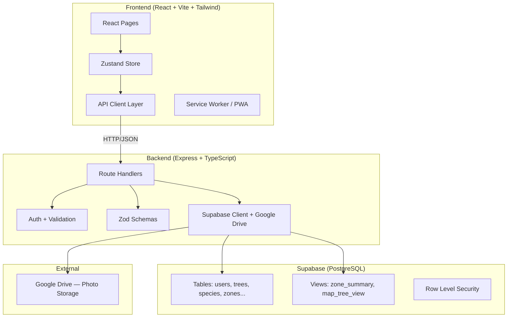
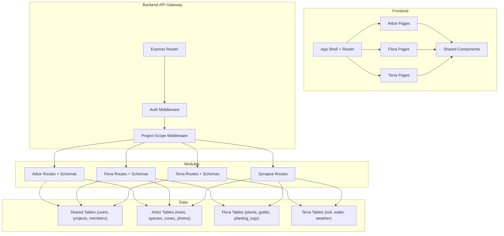
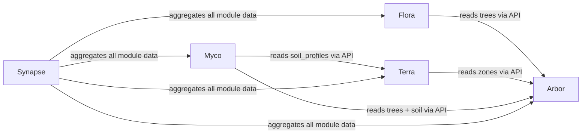

# 🏗️ Technical Architecture

> *System design, database strategy, API conventions, and module boundaries for developers.*

---

## Current State Architecture



---

## Target Architecture (Multi-Module)



---

## Tech Stack Rationale

| Layer | Choice | Why |
|-------|--------|-----|
| **Frontend Framework** | React (Vite) | Fast dev experience, huge ecosystem, strong PWA support |
| **Styling** | Tailwind CSS | Rapid prototyping, consistent design tokens, mobile-first |
| **State Management** | Zustand | Simple, no boilerplate, scales with module count |
| **Backend Runtime** | Node.js + Express | Same language as frontend (TypeScript), massive ecosystem |
| **Type System** | TypeScript (full-stack) | Catches bugs at compile time, self-documenting APIs |
| **Validation** | Zod | Schema-first validation, TypeScript-native, shared between frontend/backend |
| **Database** | Supabase (PostgreSQL) | Managed Postgres, built-in auth (optional), REST + realtime, free tier |
| **File Storage** | Google Drive API | Free storage, organized folder structure, shareable links |
| **Deployment** | Unified (Express serves React build) | Simple single-service deployment, works on Render/Railway/Vercel |

### Future Tech Considerations

| Need | Options Under Consideration |
|------|-----------------------------|
| **GIS / Real Maps** | Leaflet.js (free) or Mapbox GL (freemium) |
| **Real-time Updates** | Supabase Realtime or Socket.io |
| **Background Jobs** | BullMQ (Redis-backed) for notifications, data processing |
| **File Storage V2** | Supabase Storage (simpler) or S3-compatible |
| **IoT Data Ingestion** | MQTT broker → Express webhook → Supabase |
| **Graph Visualization** | D3.js force-directed graphs for Mind Maps |
| **Search** | PostgreSQL full-text search (pg_trgm) or Meilisearch |
| **Mobile** | React Native (if PWA insufficient) or Capacitor |

---

## Database Design Philosophy

### Naming Conventions
| Convention | Example | Rule |
|------------|---------|------|
| Table names | `trees`, `soil_profiles` | lowercase, plural, snake_case |
| Column names | `health_score`, `created_at` | lowercase, snake_case |
| Primary keys | `id` | Always `id` (bigint serial or uuid) |
| Foreign keys | `tree_id`, `zone_id` | `{table_singular}_id` |
| Timestamps | `created_at`, `updated_at` | Always `timestamptz`, always present |
| Soft deletes | `is_active` | Boolean flag, never hard delete users |
| Enums | `project_role`, `tree_status` | PostgreSQL `CREATE TYPE` enums |

### Shared Tables (Core)
These tables are used by every module:

```sql
-- Already exists
users (id, name, email, password_hash, role, phone, bio, profile_photo, is_active, created_at)
projects (id, name, description, owner_id, created_at)
project_members (project_id, user_id, role, created_at)
```

### Module-Specific Tables

Each module "owns" its tables but can READ from other modules' tables through defined interfaces:

```
Module OWNS:          Module CAN READ:
─────────────         ─────────────────
Arbor:                Core: users, projects
  trees               Core: project_members
  species              
  land_zones           
  tree_activity_log    
  tree_health_observations
  tree_photos          
  tree_contributors    
  ecosystem_roles      

Flora:                Core: users, projects
  plants              Arbor: trees, species, land_zones
  guilds               
  guild_members        
  planting_logs        
  companion_scores     

Terra:                Core: users, projects
  soil_profiles       Arbor: land_zones
  water_sources        
  weather_logs         
  elevation_points     

Myco:                 Core: users, projects
  fungi_species       Arbor: trees, land_zones
  inoculations        Terra: soil_profiles
  decomposition_logs   
  mushroom_yields      
  micro_observations   
```

---

## API Design Conventions

### URL Structure
```
/api/{module}/{resource}
/api/{module}/{resource}/:id
/api/{module}/{resource}/:id/{sub-resource}
```

#### Current Arbor APIs (to be prefixed)
| Current | Target |
|---------|--------|
| `POST /api/auth/login` | `POST /api/auth/login` (unchanged — shared) |
| `GET /api/trees` | `GET /api/arbor/trees` |
| `GET /api/trees/:code/health` | `GET /api/arbor/trees/:code/health` |
| `GET /api/species` | `GET /api/arbor/species` |
| `GET /api/zones` | `GET /api/arbor/zones` |
| `GET /api/map/trees` | `GET /api/arbor/map/trees` |
| `GET /api/dashboard/stats` | `GET /api/arbor/dashboard/stats` |

#### Future Flora APIs
```
GET    /api/flora/plants
POST   /api/flora/plants
GET    /api/flora/guilds
POST   /api/flora/guilds
POST   /api/flora/guilds/:id/members
GET    /api/flora/planting-logs
POST   /api/flora/planting-logs
GET    /api/flora/companion-scores
```

#### Future Terra APIs
```
GET    /api/terra/soil-profiles
POST   /api/terra/soil-profiles
GET    /api/terra/water-sources
POST   /api/terra/water-sources
GET    /api/terra/weather
```

### Request/Response Standards
```typescript
// Success response
{
  data: T | T[],
  total?: number,        // for paginated lists
  page?: number
}

// Error response
{
  error: string,
  code?: string,         // machine-readable error code
  details?: object       // validation errors
}
```

### Authentication
All module APIs require authentication via JWT Bearer token:
```
Authorization: Bearer <jwt_token>
```

Project-scoped endpoints additionally require:
```
X-Project-Id: <uuid>    // or via query param ?project_id=<uuid>
```

---

## Frontend Architecture

### Page Routing Convention
```
/login, /signup                        → Public auth pages
/tree/:code                            → Public tree profile (no auth)

/home                                  → Role-based home redirect
/arbor/trees                           → Tree list
/arbor/trees/new                       → Add tree
/arbor/trees/:code                     → Tree detail
/arbor/trees/:code/edit                → Edit tree
/arbor/trees/:code/health              → Health log
/arbor/trees/:code/activity            → Activity log
/arbor/map                             → Map view
/arbor/dashboard                       → Owner dashboard

/flora/plants                          → Plant list (future)
/flora/guilds                          → Guild designer (future)
/flora/guilds/:id                      → Guild detail (future)

/terra/soil                            → Soil dashboard (future)
/terra/water                           → Water sources (future)

/settings/employees                    → Employee management
/settings/profile                      → User profile
/settings/projects                     → Project management (future)
```

### Component Hierarchy
```
<App>
  <BrowserRouter>
    <Routes>
      <PublicRoutes>        → Login, Signup, PublicTree
      <RequireAuth>
        <Layout>            → BottomNav, top padding
          <ModuleRoutes>    → Arbor, Flora, Terra pages
          <SettingsRoutes>  → Profile, Employees, Projects
        </Layout>
      </RequireAuth>
    </Routes>
  </BrowserRouter>
</App>
```

### Shared Components (Design System)
| Component | Purpose |
|-----------|---------|
| `Spinner` | Loading state with label |
| `EmptyState` | No-data placeholder with icon |
| `ActionBadge` | Color-coded action indicator |
| `HealthBadge` | Health score indicator (1-10) |
| `TreeCard` | Compact tree summary card |
| `MapCanvas` | Interactive tree position canvas |
| `MapPicker` | Click-to-place coordinate selector |
| `Layout` | App shell with bottom navigation |
| `Modal` (needed) | Reusable modal dialog |
| `DataTable` (needed) | Sortable, filterable table component |
| `StatCard` (needed) | Reusable dashboard stat card |
| `FormField` (needed) | Standardized form input |

---

## Cross-Module Communication

Modules communicate through **shared database tables** and **RESTful API calls**, not through direct code imports.



### Rules for Cross-Module Access
1. **Modules NEVER directly import each other's code** (no `import { tree } from '../arbor'`)
2. Modules MAY read from shared tables (`users`, `projects`, `project_members`)
3. Modules MAY read from other modules' tables via **read-only Supabase queries** (views preferred)
4. Cross-module writes happen through **the owning module's API** (e.g., Flora creates a `planting_log` that references `tree_id`, but does NOT update the `trees` table directly)

---

## Security Model

### Authentication Flow
```
Client → POST /api/auth/login (email, password)
       ← { token, refreshToken, user }
       
Client → GET /api/arbor/trees (Authorization: Bearer <token>)

Client → POST /api/auth/refresh (refreshToken)
       ← { token }
```

### Authorization Levels

| Level | Scope | Description |
|-------|-------|-------------|
| **System Role** | Global | `owner`, `employee`, `volunteer` — defined on `users` table |
| **Project Role** | Per-project | `admin`, `editor`, `contributor`, `viewer` — defined on `project_members` |

#### Effective Permissions Matrix

| Action | System Owner | Project Admin | Editor | Contributor | Viewer |
|--------|:---:|:---:|:---:|:---:|:---:|
| Create project | ✅ | ❌ | ❌ | ❌ | ❌ |
| Manage project members | ✅ | ✅ | ❌ | ❌ | ❌ |
| Add/delete trees | ✅ | ✅ | ✅ | ❌ | ❌ |
| Edit trees | ✅ | ✅ | ✅ | ❌ | ❌ |
| Log health/activity | ✅ | ✅ | ✅ | ✅ | ❌ |
| Upload photos | ✅ | ✅ | ✅ | ✅ | ❌ |
| View data | ✅ | ✅ | ✅ | ✅ | ✅ |

---

## Testing Strategy (To Implement)

| Type | Tools | Coverage Target |
|------|-------|-----------------|
| **Unit Tests** | Vitest (frontend) + Jest (backend) | Schema validation, utility functions |
| **API Integration Tests** | Supertest + test DB | All route handlers |
| **E2E Tests** | Playwright | Critical user flows (login, add tree, log health) |
| **Linting** | ESLint + Prettier | Consistent code style |
| **Type Checking** | TypeScript strict mode | Full type safety |

---

*This architecture is designed to scale from 1 contributor to 50, and from 1 module to 5, without requiring a rewrite.*
